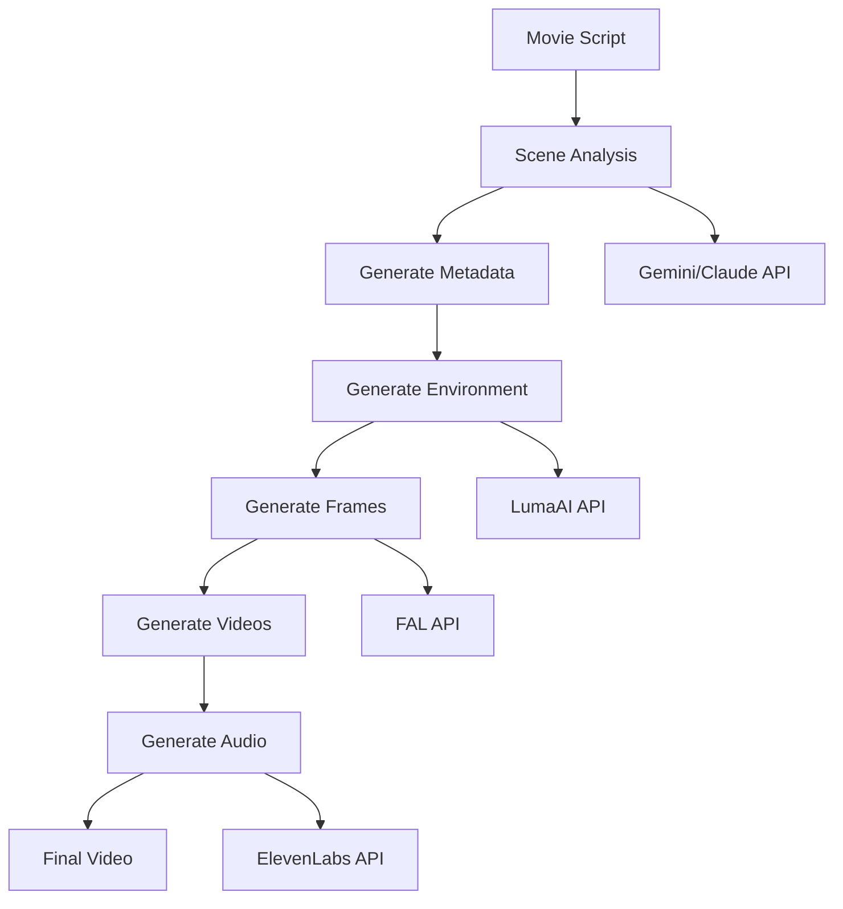
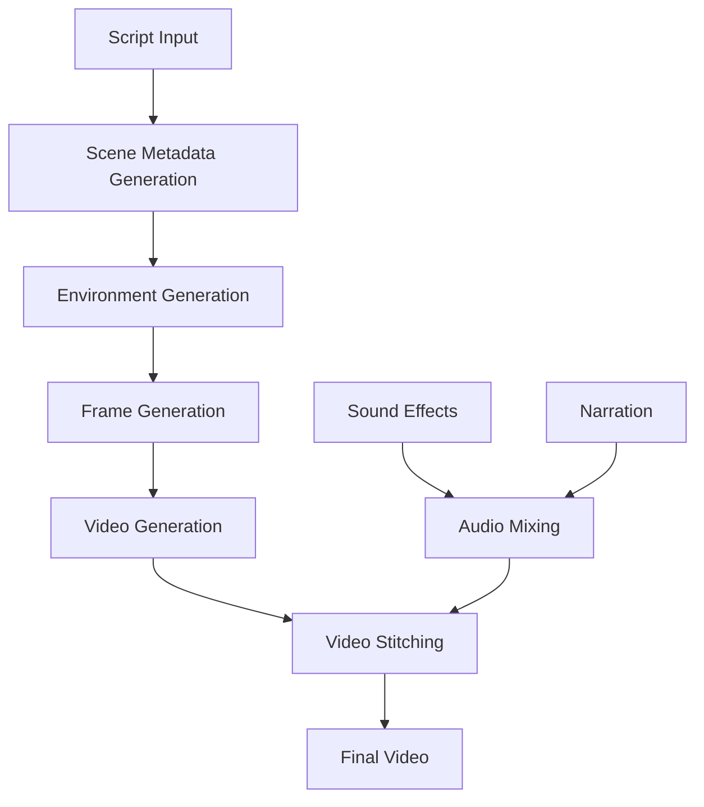
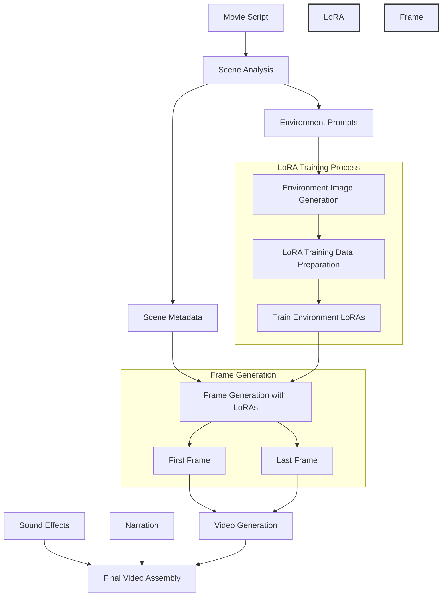
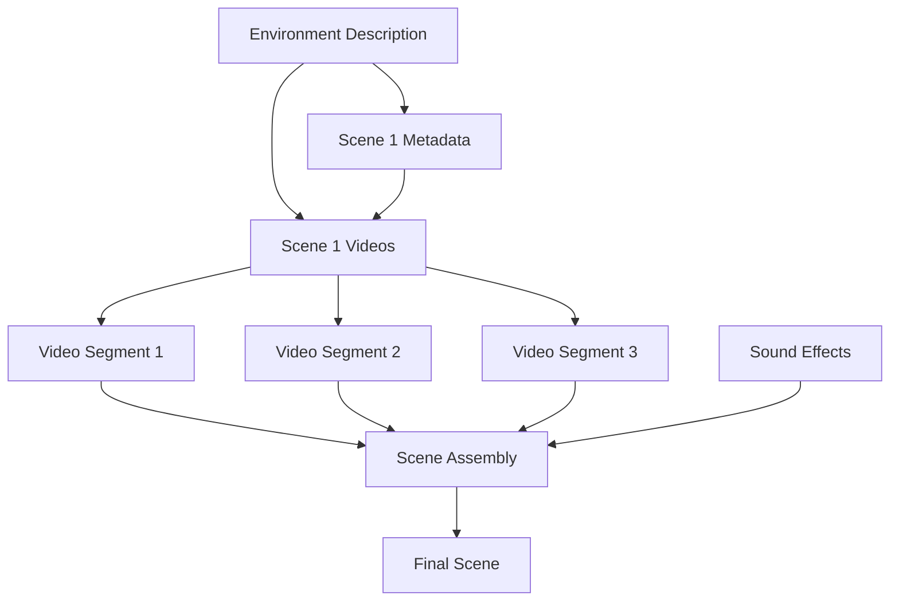
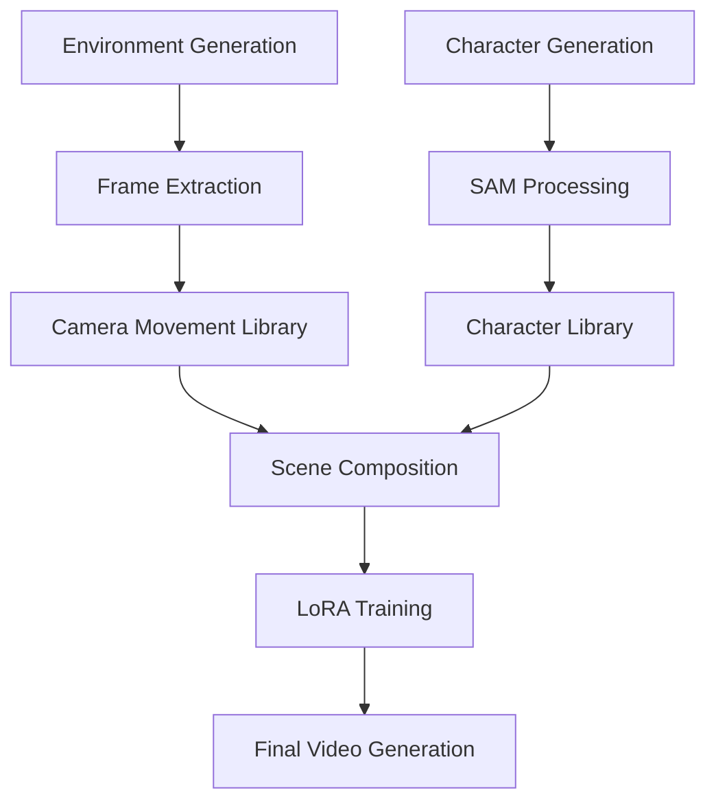

# A Thousand Hands: AI Agentic Video Generation System with Scene Consistency

An end-to-end application that transforms text scripts into complete video productions with synchronized audio, narration, and visual effects using Claude, Gemini, ElevenLabs, and LumaAI.

## Features

- Script analysis and scene breakdown
- Physical environment generation 
- Video generation with custom durations (5-9s)
- Sound effect and narration synthesis
- Automated video stitching
- LoRA training and frame generation
- Multi-model support (Gemini/Claude)
- User-friendly Gradio web interface
- Initial frame customization options:
  - Upload local images as starting frames
  - Generate initial frames using Luma AI or FAL prompts
  - First frame generation for each scene
  - Choice between Luma AI and FAL for image generation
- Support for custom starting frames with LTX engine
- Random script generation with customizable elements
- Flexible video initialization options:
  - Upload local images as starting frames
  - Generate initial frames using Luma AI prompts
  - Seamless integration with video generation pipeline

> **⚠️ Important Note (February 11, 2025)**: 
> The Luma AI Ray-2 video generation model currently does not support first and last frame keyframe generation. As a result:
> - Video generation is only available with the LTX video engine
> - Attempts to use Luma will result in errors
> - This limitation is temporary and will be resolved in an upcoming Luma API update
> - Please use the LTX video engine in the meantime

## System Architecture

### High-Level Flow


### Video Generation Process


### LoRA-Enhanced Video Generation Process
The `video_generation_with_lora.py` script provides an enhanced version of the video generation process that uses LoRA (Low-Rank Adaptation) models for better scene consistency:



Key differences from the basic video generation:
1. **Environment LoRA Training**: 
   - Generates training images for each environment
   - Trains custom LoRA models for consistent scene aesthetics
   - Creates environment-specific trigger words

2. **Frame Generation**:
   - Uses trained LoRAs to generate consistent first/last frames
   - Maintains visual style across scene transitions
   - Better environment and character consistency

3. **Video Generation**:
   - Uses LoRA-generated frames as keyframes
   - Ensures smooth transitions between scenes
   - Maintains consistent visual style throughout

4. **Reusability**:
   - Trained LoRAs can be saved and reused
   - Supports pre-trained LoRA directory input
   - Enables consistent style across multiple videos

## Directory Structure

The system creates the following directory structure during execution:

```
generated_videos/
└── videos_[TIMESTAMP]/
    ├── scene_metadata_[TIMESTAMP].json
    ├── scene_physical_environment_[TIMESTAMP].json
    ├── narration_text_[TIMESTAMP].txt
    ├── narration_audio_[TIMESTAMP].mp3
    ├── narration_audio_adjusted_[TIMESTAMP].mp3
    ├── final_video_[TIMESTAMP].mp4
    ├── lora_training_data/
    │   └── environment_[N]/
    │       └── [training images]
    ├── scene_frames/
    │   └── scene_[N]/
    │       ├── first_frame.jpg
    │       └── last_frame.jpg
    └── scene_[N]_all_vid_[TIMESTAMP]/
        ├── scene_[N]_[TIMESTAMP].mp4
        └── scene_[N]_sound.mp3
```
Prompt Flow:


## Prompt Structure and Video Generation Flow

The system uses a sophisticated prompting structure to ensure consistency across generated video segments:

### Environment Description Prompts
- Each scene has a single, comprehensive environment description prompt that spans all video segments
- This "anchor prompt" ensures physical environment consistency across the entire scene
- Contains detailed descriptions of:
  - Physical layout and architecture
  - Lighting conditions
  - Atmospheric elements
  - Key environmental features
  - Time of day and weather conditions

### Scene Metadata Prompts
- Multiple metadata prompts per scene guide the specific actions and movements
- Each prompt corresponds to a video segment within the scene
- Contains:
  - Character positions and movements
  - Camera angles and transitions
  - Specific actions and events
  - Temporal flow markers

### Video Segmentation
Due to technical limitations of current video generation models (including LumaAI):
- Each scene is broken into multiple shorter video segments (5-9 seconds each)
- Videos are generated with overlapping elements for smooth transitions
- The consistent environment prompt ensures visual continuity
- Multiple videos are stitched together to form complete scenes

### Sound Effects
- Each video segment has corresponding sound effects
- Effects are synchronized with specific actions
- Mixed with narration track during final assembly

### Final Assembly
- Individual video segments are combined using the overlapping sections
- Sound effects and narration are synchronized
- Environment consistency across segments creates seamless longer scenes
- Multiple scenes are combined into the final video production



Where:
- `[TIMESTAMP]`: Format YYYYMMDD_HHMMSS
- `[N]`: Scene number
- Each scene can have multiple video segments based on duration

## Installation

### Prerequisites

1. Python 3.8 or higher
2. Required Python packages:
```bash
pip install -r requirements.txt
```

### API Keys Required

The following API keys and credentials are required to use the system:

1. **Gemini API Key** - For text generation and scene analysis
   - Get from: [Google AI Studio](https://makersuite.google.com/app/apikey)
   - Used for: Scene analysis and metadata generation

2. **ElevenLabs API Key** - For voice synthesis and sound effects
   - Get from: [ElevenLabs](https://elevenlabs.io/speech-synthesis)
   - Used for: Narration and sound effects generation

3. **LumaAI API Key** - For video generation
   - Get from: [LumaAI](https://lumalabs.ai/)
   - Used for: Video generation and scene rendering

4. **Anthropic API Key** - For Claude model access
   - Get from: [Anthropic](https://www.anthropic.com/)
   - Used for: Alternative scene analysis model

5. **FAL API Key** - For LoRA training and inference
   - Get from: [FAL.AI](https://www.fal.ai/)
   - Used for: Training custom models for scene consistency

6. **Google Cloud Storage**:
   - Create from: [Google Cloud Console](https://console.cloud.google.com)
   - Required:
     - Bucket Name
     - Service Account Credentials JSON file
   - Used for: Storing and managing generated assets

### Setting up Google Cloud Credentials

1. Go to the [Google Cloud Console](https://console.cloud.google.com)
2. Create a new project or select an existing one
3. Enable the Cloud Storage API
4. Go to IAM & Admin > Service Accounts
5. Create a new service account or select an existing one
6. Create a new key (JSON type)
7. Download the JSON file - you'll need this for the application

## Usage

### Using the Gradio Web Interface

1. Start the Gradio app:
```bash
python video_generation_app.py
```

2. Open your browser and navigate to `http://localhost:7860`

3. In the "API Keys Setup" tab:
   - Enter all required API keys
   - Upload your Google Cloud Service Account credentials JSON file
   - Enter your GCP bucket name
   - Click "Save API Keys" (this will save the keys to the .env file)
   - Saving API keys is not necessary to use the video generation app
   - If you do not have the API keys, you can enter "none" and the app will choose the default keys

4. In the "Video Generation" tab:
   - Enter your movie script or use the random script generation feature:
     - Check "Generate Random Script" to use a randomly generated script
     - Click "Preview Random Script" to see what will be generated before creating a video
     - The random script will use the selected model (Gemini or Claude)
   - Choose the model (Gemini or Claude)
   - Select video engine (Luma or LTX)
   - Optional settings:
     - Skip narration generation
     - Skip sound effects generation
     - Generate metadata only
     - Customize maximum scenes and environments
   - Click "Generate Video"

### Different Video Generation Scripts

The project includes two main video generation scripts:

1. **video_generation.py** (Used by Gradio App)
   - Basic video generation without LoRA training
   - Suitable for simpler video generation needs
   - Used by the Gradio web interface
   - Does not require FAL API key
   - Faster generation but less consistent scene transitions

2. **video_generation_with_lora.py** (Advanced CLI Version)
   - Advanced version with LoRA training capabilities
   - Better scene consistency through custom model training
   - Must be run from command line
   - Requires FAL API key for LoRA training
   - Command line usage:
   ```bash
   # Generate video with LoRA training
   python video_generation_with_lora.py --model gemini

   # Use pre-trained LoRAs
   python video_generation_with_lora.py --model gemini --trained_lora_dir /path/to/lora/dir

   # Generate only narration
   python video_generation_with_lora.py --narration_only

   # Skip narration generation
   python video_generation_with_lora.py --skip_narration
   ```

**Note**: If you don't need LoRA-based scene consistency, use the Gradio app with `video_generation.py`. The FAL API key is only required for `video_generation_with_lora.py` when using LoRA training.

### Using Command Line

Alternatively, you can use the command line interface for basic video generation:

```bash
# Basic usage with default script file
python video_generation.py --model gemini --metadata_only

# Use FAL for image generation (default)
python video_generation.py --model gemini --first_frame_image_gen

# Use Luma AI for image generation
python video_generation.py --model gemini --first_frame_image_gen --image_gen_model luma

# Generate initial image with FAL
python video_generation.py --model gemini --initial_image_prompt "your prompt" --image_gen_model fal

# Generate initial image with Luma AI
python video_generation.py --model gemini --initial_image_prompt "your prompt" --image_gen_model luma
```

### Command Line Arguments

- `--model`: Choose between 'gemini' or 'claude' for scene analysis (default: gemini)
- `--video_engine`: Choose between 'luma' or 'ltx' for video generation (default: luma)
- `--image_gen_model`: Choose between 'luma' or 'fal' for image generation (default: fal)
- `--metadata_only`: Generate only scene metadata without video
- `--script_file`: Path to your movie script file
- `--random_script`: Generate a random script instead of using a script file
- `--skip_narration`: Skip generating narration audio
- `--skip_sound_effects`: Skip generating sound effects
- `--max_scenes`: Maximum number of scenes to generate (default: 5)
- `--max_environments`: Maximum number of unique environments to use (default: 3)
- `--first_frame_image_gen`: Generate first frame images for each scene

For random script generation:
```bash
python random_script_generator.py --help
```

- `--model`: Choose between 'gemini' or 'claude' for script generation (default: gemini)
- `--output`: Output file for the generated script (default: random_script.txt)
- `--video_gen`: Generate a video using the random script
- `--video_engine`: Choose between 'luma' or 'ltx' for video generation (default: luma)
- `--max_scenes`: Maximum number of scenes to generate (default: 5)
- `--max_environments`: Maximum number of environments to use (default: 3)
- `--skip_narration`: Skip narration generation
- `--skip_sound_effects`: Skip sound effects generation

## Generation Process

1. **Script Analysis**
   - Input script is analyzed by Gemini/Claude
   - Determines optimal number of scenes
   - Generates scene metadata including:
     - Physical environment descriptions
     - Movement descriptions
     - Camera instructions
     - Emotional atmosphere

2. **Environment Generation**
   - Creates detailed environment descriptions
   - Generates training data for LoRA models
   - Trains custom models for scene consistency

3. **Frame Generation**
   - Generates key frames for each scene
   - Uses trained LoRA models
   - Ensures visual consistency

4. **Video Generation**
   - Generates video segments using LumaAI
   - Handles scene transitions
   - Manages video duration constraints

5. **Audio Generation**
   - Creates narration using ElevenLabs
   - Generates scene-specific sound effects
   - Adjusts audio timing to match video

6. **Final Assembly**
   - Stitches video segments together
   - Synchronizes audio and video
   - Produces final output video

## Security Note
- Never commit the `.env` file or credentials to version control
- Keep your API keys and credentials secure
- Add both `.env` and your GCP credentials JSON file to `.gitignore`
- Store your credentials securely and never share them

## Getting Started
1. Clone the repository
2. Install dependencies: `pip install -r requirements.txt`
3. Set up your Google Cloud project and get your credentials JSON file
4. Start the Gradio app: `python video_generation_app.py`
5. Enter your API keys and upload your GCP credentials in the web interface
6. Start generating videos!

## Troubleshooting

### Common Issues

1. **API Key Errors**
   - Verify all API keys are correctly entered
   - Check for any spaces or special characters
   - Ensure keys have necessary permissions

2. **Storage Issues**
   - Ensure GCP bucket exists and is accessible
   - Verify service account has proper permissions
   - Check available storage space

3. **Generation Failures**
   - Check API quotas and limits
   - Verify script length and complexity
   - Monitor system resources

### Error Messages

- "GCP credentials file not found": Upload credentials JSON in API Keys Setup
- "Invalid scene duration": Scene duration must be 5, 9, 14, or 18 seconds
- "Generation failed": Check API quotas and error details

## Contributing

1. Fork the repository
2. Create a feature branch
3. Commit your changes
4. Push to the branch
5. Create a Pull Request

## License

This project is licensed under the MIT License - see the LICENSE file for details.

## TODO and Future Updates

### Improved Scene Consistency

We plan to implement several advanced techniques to significantly improve scene and character consistency across video generations:

1. **Advanced Environment Frame Generation**
   - Implement Gaussian Splatting or specialized video generation for physical environments
   - Generate high-quality first and last frames for each environment type
   - Support various camera movements:
     - Panning (left/right)
     - Tilting (up/down)
     - Zooming (in/out)
     - Dolly (forward/backward)
   - Create a dictionary of pre-generated environment transitions
   - Allow users to customize and select preferred environment transitions

2. **Character Generation and Integration**
   - Separate character generation from environment generation
   - Generate characters independently with specific movement prompts
   - Maintain consistent character appearance across scenes
   - Support multiple characters with distinct characteristics
   - Enable complex character interactions

3. **Foreground-Background Separation**
   - Integrate [Segment Anything Model (SAM) by Meta](https://segment-anything.com/)
   - Extract and separate foreground (characters) from background (environment)
   - Enable precise character placement in environments
   - Improve character-environment interaction
   - Support dynamic lighting and shadow adjustments

4. **Enhanced Scene Composition**
   - Match characters with appropriate environment frames
   - Align character movements with camera transitions
   - Ensure lighting consistency between characters and environments
   - Maintain spatial relationships across scene transitions

5. **LoRA Training Improvements**
   - Train specialized LoRAs for each physical environment type
   - Develop character-specific LoRAs for consistent appearance
   - Create transition-specific LoRAs for smooth scene changes
   - Enable fine-tuning of existing LoRAs for custom requirements

### Implementation Flow



### Technical Components

1. **Environment Frame Database**
   ```python
   environment_frames = {
       'forest': {
           'pan_left': {'first_frame': 'url1', 'last_frame': 'url2'},
           'pan_right': {'first_frame': 'url3', 'last_frame': 'url4'},
           'zoom_in': {'first_frame': 'url5', 'last_frame': 'url6'},
           # ... more camera movements
       },
       'city_street': {
           # ... similar structure for each environment
       }
   }
   ```

2. **Character Generation Control**
   ```python
   character_config = {
       'character_id': 'protagonist',
       'appearance': {
           'gender': 'female',
           'age': '30s',
           'clothing': 'business_suit',
           'distinct_features': ['red_hair', 'tall']
       },
       'movements': ['walking', 'running', 'sitting'],
       'emotions': ['happy', 'serious', 'concerned']
   }
   ```

3. **Scene Composition Rules**
   ```python
   scene_rules = {
       'lighting_match': True,
       'perspective_match': True,
       'scale_match': True,
       'shadow_generation': True,
       'depth_consistency': True
   }
   ```

### Benefits

- More consistent and high-quality video generation
- Better control over scene transitions
- Improved character consistency across scenes
- More realistic character-environment integration
- Smoother camera movements
- Enhanced storytelling capabilities

### Getting Started with Development

If you'd like to contribute to these improvements:

1. Fork the repository
2. Choose a feature from the TODO list
3. Create a feature branch
4. Implement and test your changes
5. Submit a pull request

We welcome contributions and suggestions for additional improvements!

## Environment Setup

This project requires several environment variables to be set up. Create a `.env` file in the root directory with the following variables:

```env
# Google Cloud Storage Configuration
BUCKET_NAME=your-bucket-name
CREDENTIALS_FILE=your-credentials-file.json

# API Keys and Configuration
LUMA_API_TOKEN=your_luma_token
GEMINI_API_KEY=your_gemini_api_key
FAL_API_KEY=your_fal_api_key
ANTHROPIC_API_KEY=your_anthropic_api_key
ELEVEN_LABS_API_KEY=your_eleven_labs_api_key
```

Note: For image generation, you'll need either:
- LUMA_API_TOKEN if using Luma AI for image generation
- FAL_API_KEY if using FAL for image generation (default)

Make sure to replace the `your_*` placeholders with your actual API keys and credentials.

## Security Note
- Never commit the `.env` file to version control
- Keep your API keys and credentials secure
- The `.env` file should be added to your `.gitignore`

## Getting Started
1. Copy the `.env.example` file to `.env`
2. Fill in your actual API keys and credentials
3. Ensure you have the Google Cloud credentials JSON file in your project root
