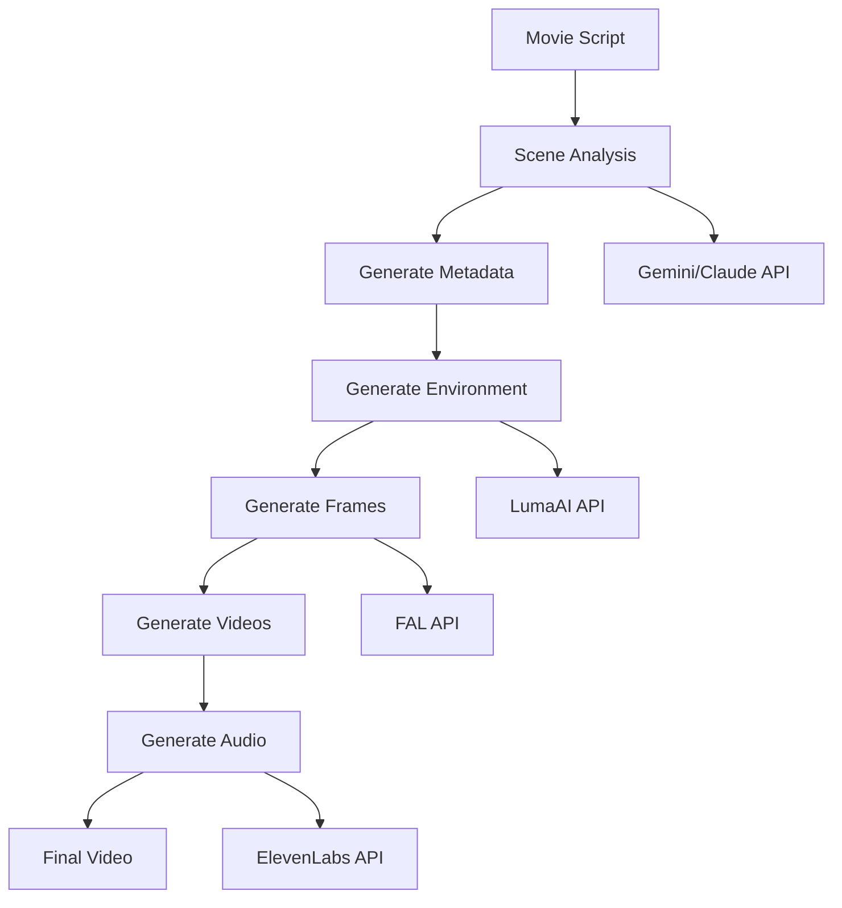
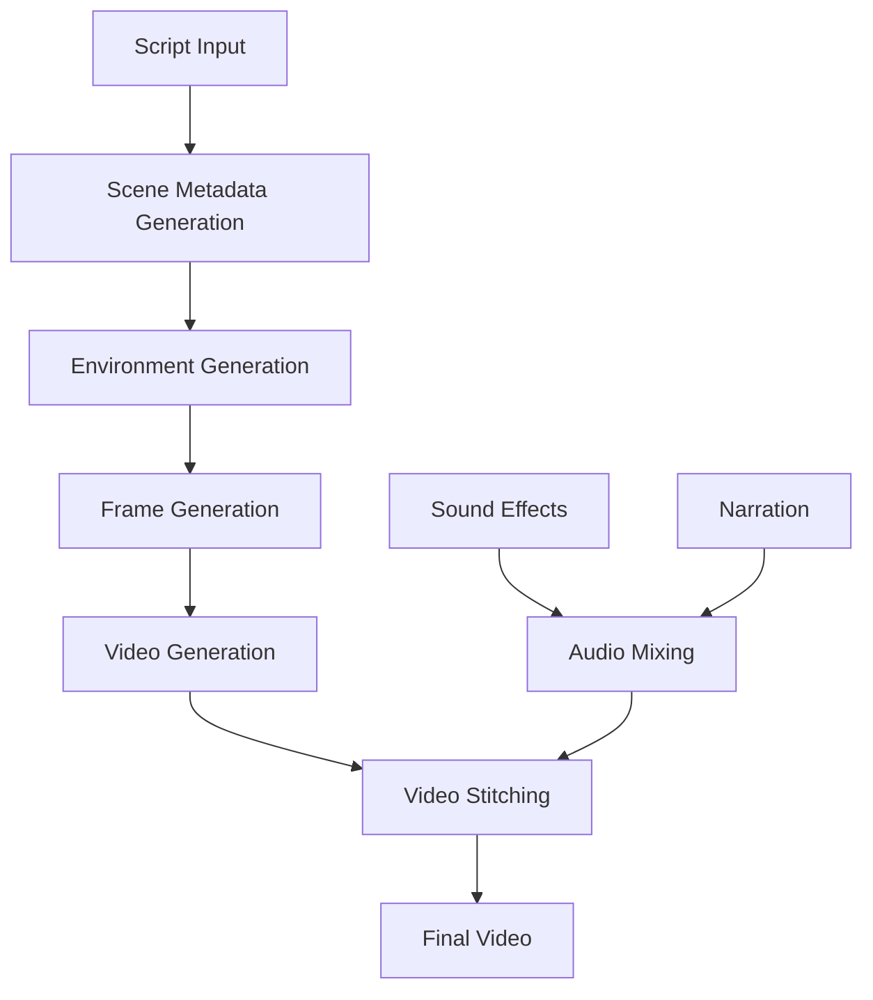

# Video Generation System

A sophisticated Python application that transforms text scripts into complete video productions with synchronized audio, narration, and visual effects using Claude, Gemini, ElevenLabs, and LumaAI.

## Features

- Script analysis and scene breakdown
- Physical environment generation 
- Video generation with custom durations (5-9s)
- Sound effect and narration synthesis
- Automated video stitching
- LoRA training and frame generation
- Multi-model support (Gemini/Claude)
- User-friendly Gradio web interface

## System Architecture

### High-Level Flow


### Video Generation Process


## Directory Structure

The system creates the following directory structure during execution:

```
luma_generated_videos/
└── luma_generation_[TIMESTAMP]/
    ├── scene_metadata_[TIMESTAMP].json
    ├── scene_physical_environment_[TIMESTAMP].json
    ├── narration_text_[TIMESTAMP].txt
    ├── narration_audio_[TIMESTAMP].mp3
    ├── narration_audio_adjusted_[TIMESTAMP].mp3
    ├── luma_final_video_[TIMESTAMP].mp4
    ├── lora_training_data/
    │   └── environment_[N]/
    │       └── [training images]
    ├── scene_frames/
    │   └── scene_[N]/
    │       ├── first_frame.jpg
    │       └── last_frame.jpg
    └── scene_[N]_all_vid_[TIMESTAMP]/
        ├── scene_[N]_[TIMESTAMP].mp4
        └── scene_[N]_sound.mp3
```

Where:
- `[TIMESTAMP]`: Format YYYYMMDD_HHMMSS
- `[N]`: Scene number
- Each scene can have multiple video segments based on duration

## Installation

### Prerequisites

1. Python 3.8 or higher
2. Required Python packages:
```bash
pip install -r requirements.txt
```

### API Keys Required

The following API keys and credentials are required to use the system:

1. **Gemini API Key** - For text generation and scene analysis
   - Get from: [Google AI Studio](https://makersuite.google.com/app/apikey)
   - Used for: Scene analysis and metadata generation

2. **ElevenLabs API Key** - For voice synthesis and sound effects
   - Get from: [ElevenLabs](https://elevenlabs.io/speech-synthesis)
   - Used for: Narration and sound effects generation

3. **LumaAI API Key** - For video generation
   - Get from: [LumaAI](https://lumalabs.ai/)
   - Used for: Video generation and scene rendering

4. **Anthropic API Key** - For Claude model access
   - Get from: [Anthropic](https://www.anthropic.com/)
   - Used for: Alternative scene analysis model

5. **FAL API Key** - For LoRA training and inference
   - Get from: [FAL.AI](https://www.fal.ai/)
   - Used for: Training custom models for scene consistency

6. **Google Cloud Storage**:
   - Create from: [Google Cloud Console](https://console.cloud.google.com)
   - Required:
     - Bucket Name
     - Service Account Credentials JSON file
   - Used for: Storing and managing generated assets

### Setting up Google Cloud Credentials

1. Go to the [Google Cloud Console](https://console.cloud.google.com)
2. Create a new project or select an existing one
3. Enable the Cloud Storage API
4. Go to IAM & Admin > Service Accounts
5. Create a new service account or select an existing one
6. Create a new key (JSON type)
7. Download the JSON file - you'll need this for the application

## Usage

### Using the Gradio Web Interface

1. Start the Gradio app:
```bash
python video_generation_app.py
```

2. Open your browser and navigate to `http://localhost:7860`

3. In the "API Keys Setup" tab:
   - Enter all required API keys
   - Upload your Google Cloud Service Account credentials JSON file
   - Enter your GCP bucket name
   - Click "Save API Keys"

4. In the "Video Generation" tab:
   - Enter your movie script
   - Choose the model (Gemini or Claude)
   - Optionally check "Generate Metadata Only" to preview scene breakdown
   - Click "Generate Video"

### Using Command Line

Alternatively, you can use the command line interface:

```bash
python video_generation.py --model gemini --metadata_only
```

## Generation Process

1. **Script Analysis**
   - Input script is analyzed by Gemini/Claude
   - Determines optimal number of scenes
   - Generates scene metadata including:
     - Physical environment descriptions
     - Movement descriptions
     - Camera instructions
     - Emotional atmosphere

2. **Environment Generation**
   - Creates detailed environment descriptions
   - Generates training data for LoRA models
   - Trains custom models for scene consistency

3. **Frame Generation**
   - Generates key frames for each scene
   - Uses trained LoRA models
   - Ensures visual consistency

4. **Video Generation**
   - Generates video segments using LumaAI
   - Handles scene transitions
   - Manages video duration constraints

5. **Audio Generation**
   - Creates narration using ElevenLabs
   - Generates scene-specific sound effects
   - Adjusts audio timing to match video

6. **Final Assembly**
   - Stitches video segments together
   - Synchronizes audio and video
   - Produces final output video

## Security Note
- Never commit the `.env` file or credentials to version control
- Keep your API keys and credentials secure
- Add both `.env` and your GCP credentials JSON file to `.gitignore`
- Store your credentials securely and never share them

## Getting Started
1. Clone the repository
2. Install dependencies: `pip install -r requirements.txt`
3. Set up your Google Cloud project and get your credentials JSON file
4. Start the Gradio app: `python video_generation_app.py`
5. Enter your API keys and upload your GCP credentials in the web interface
6. Start generating videos!

## Troubleshooting

### Common Issues

1. **API Key Errors**
   - Verify all API keys are correctly entered
   - Check for any spaces or special characters
   - Ensure keys have necessary permissions

2. **Storage Issues**
   - Ensure GCP bucket exists and is accessible
   - Verify service account has proper permissions
   - Check available storage space

3. **Generation Failures**
   - Check API quotas and limits
   - Verify script length and complexity
   - Monitor system resources

### Error Messages

- "GCP credentials file not found": Upload credentials JSON in API Keys Setup
- "Invalid scene duration": Scene duration must be 5, 9, 14, or 18 seconds
- "Generation failed": Check API quotas and error details

## Contributing

1. Fork the repository
2. Create a feature branch
3. Commit your changes
4. Push to the branch
5. Create a Pull Request

## License

This project is licensed under the MIT License - see the LICENSE file for details.

# Luma AI Hackathon Project

## Environment Setup

This project requires several environment variables to be set up. Create a `.env` file in the root directory with the following variables:

```env
# Google Cloud Storage Configuration
BUCKET_NAME=hackathon-bucket-demandio
CREDENTIALS_FILE=demand-io-base-c29062a50662.json

# API Keys and Configuration
LUMA_API_TOKEN=your_luma_token
GEMINI_API_KEY=your_gemini_api_key
FAL_API_KEY=your_fal_api_key
ANTHROPIC_API_KEY=your_anthropic_api_key
ELEVEN_LABS_API_KEY=your_eleven_labs_api_key
```

Make sure to replace the `your_*` placeholders with your actual API keys and credentials.

## Security Note
- Never commit the `.env` file to version control
- Keep your API keys and credentials secure
- The `.env` file should be added to your `.gitignore`

## Getting Started
1. Copy the `.env.example` file to `.env`
2. Fill in your actual API keys and credentials
3. Ensure you have the Google Cloud credentials JSON file in your project root